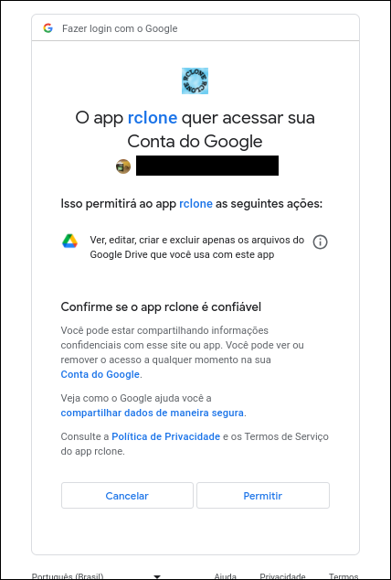

# Overview

O Google Drive, apesar de ser lento feito a disgraça, é um jeito bem popular e barato de guardar arquivos,
porém, ultimamente tá acontecendo bastante cortes de cota. Contas que eram ilimitadas não são mais. Dá para
entender o motivo, o Google não é mais o que era, tá falindo e tá precisando monetizar onde
dá, [as vezes até dando tiros no próprio pé](https://www.youtube.com/watch?v=_GARcKCaUfI).

Uma ferramenta muito popular em gerenciamento e operação de contas de armazenamento cloud de um jeito consistente
é o [rclone](https://rclone.org/). É um negócio muito simples de instalar. É um binário que precisa estar em 
alguma pasta que pertence a variável de ambiente PATH. O rclone abstrai esses armários de armazenamento em remotes,
cada remote tem um tipo, que é chamado de backend. Google Drive é um backend, tua conta do Google Drive é um remote.

Um remote, como já vou demonstrar, não precisa necessariamente ser um serviço em nuvem. Tem vários que
encapsulam e agregam outros, como o `crypt`, o `chunker` e o que eu vou apresentar aqui: o `union`.

## Union
O backend [`union`](https://rclone.org/union/) junta vários remotes e monta uma visão simples deles.

O exemplo aqui que eu vou dar é com Google Drive mas esse esquema não só funciona com backends diferentes como
também funciona entre remotes de diferentes backends.

Esse post não vai ser exaustivo sobre como usar o backend então se quiser aprender mais, leia a 
[documentação](https://rclone.org/union/) e experimente.

# Preparação dos remotes
O arranjo que eu vou mostrar aqui consiste em duas contas e um union.

Vou dar o nome dos remotes `drive_rw` e `drive_ro`. O objetivo é usar o `drive_ro`, com menos cota, só para
conferir se os arquivos existem e gerar um token do `drive_rw` que só dá permissão de gravação na conta e
leitura do que foi gravado por esse token. Depois vou agregar com `union` de forma que `drive_rw` seja
apenas usada para upar as coisas e a `drive_ro` só para ler.

## rclone.cfg
Toda parte de autenticação do rclone é salva em um arquivo. **Passar esse arquivo para qualquer pessoa dá acesso
a todas as contas definidas nesse arquivo para essa pessoa.**

Por padrão, o rclone salva esse arquivo de configuração em `~/.config/rclone/rclone.cfg` em basicamente qualquer
sistema operacional. Você pode mudar esse caminho para um comando usando a flag `--config` e passando o novo caminho.

Para fins de demonstração eu vou usar `/tmp/rclone.cfg`.

## Criação do remote `drive_ro`

- Começa abrindo o `rclone config`

```
lucasew@riverwood /tmp 0$ rclone config --config /tmp/rclone.cfg
2023/11/09 10:39:40 NOTICE: Config file "/tmp/rclone.cfg" not found - using defaults
No remotes found, make a new one?
n) New remote
s) Set configuration password
q) Quit config
n/s/q> n

Enter name for new remote.
name> drive_ro

Option Storage.
Type of storage to configure.
Choose a number from below, or type in your own value.
 1 / 1Fichier
   \ (fichier)
 2 / Akamai NetStorage
   \ (netstorage)
 3 / Alias for an existing remote
   \ (alias)
 4 / Amazon Drive
   \ (amazon cloud drive)
 5 / Amazon S3 Compliant Storage Providers including AWS, Alibaba, ArvanCloud, Ceph, China Mobile, Cloudflare, GCS, DigitalOcean, Dreamhost, Huawei OBS, IBM COS, IDrive e2, IONOS Cloud, Leviia, Liara, Lyve Cloud, Minio, Netease, Petabox, RackCorp, Scaleway, SeaweedFS, StackPath, Storj, Synology, Tencent COS, Qiniu and Wasabi
   \ (s3)
 6 / Backblaze B2
   \ (b2)
 7 / Better checksums for other remotes
   \ (hasher)
 8 / Box
   \ (box)
 9 / Cache a remote
   \ (cache)
10 / Citrix Sharefile
   \ (sharefile)
11 / Combine several remotes into one
   \ (combine)
12 / Compress a remote
   \ (compress)
13 / Dropbox
   \ (dropbox)
14 / Encrypt/Decrypt a remote
   \ (crypt)
15 / Enterprise File Fabric
   \ (filefabric)
16 / FTP
   \ (ftp)
17 / Google Cloud Storage (this is not Google Drive)
   \ (google cloud storage)
18 / Google Drive
   \ (drive)
19 / Google Photos
   \ (google photos)
20 / HTTP
   \ (http)
21 / Hadoop distributed file system
   \ (hdfs)
22 / HiDrive
   \ (hidrive)
23 / In memory object storage system.
   \ (memory)
24 / Internet Archive
   \ (internetarchive)
25 / Jottacloud
   \ (jottacloud)
26 / Koofr, Digi Storage and other Koofr-compatible storage providers
   \ (koofr)
27 / Local Disk
   \ (local)
28 / Mail.ru Cloud
   \ (mailru)
29 / Mega
   \ (mega)
30 / Microsoft Azure Blob Storage
   \ (azureblob)
31 / Microsoft OneDrive
   \ (onedrive)
32 / OpenDrive
   \ (opendrive)
33 / OpenStack Swift (Rackspace Cloud Files, Blomp Cloud Storage, Memset Memstore, OVH)
   \ (swift)
34 / Oracle Cloud Infrastructure Object Storage
   \ (oracleobjectstorage)
35 / Pcloud
   \ (pcloud)
36 / PikPak
   \ (pikpak)
37 / Proton Drive
   \ (protondrive)
38 / Put.io
   \ (putio)
39 / QingCloud Object Storage
   \ (qingstor)
40 / Quatrix by Maytech
   \ (quatrix)
41 / SMB / CIFS
   \ (smb)
42 / SSH/SFTP
   \ (sftp)
43 / Sia Decentralized Cloud
   \ (sia)
44 / Storj Decentralized Cloud Storage
   \ (storj)
45 / Sugarsync
   \ (sugarsync)
46 / Transparently chunk/split large files
   \ (chunker)
47 / Union merges the contents of several upstream fs
   \ (union)
48 / Uptobox
   \ (uptobox)
49 / WebDAV
   \ (webdav)
50 / Yandex Disk
   \ (yandex)
51 / Zoho
   \ (zoho)
52 / premiumize.me
   \ (premiumizeme)
53 / seafile
   \ (seafile)
Storage> drive

Option client_id.
Google Application Client Id
Setting your own is recommended.
See https://rclone.org/drive/#making-your-own-client-id for how to create your own.
If you leave this blank, it will use an internal key which is low performance.
Enter a value. Press Enter to leave empty.
client_id> 

Option client_secret.
OAuth Client Secret.
Leave blank normally.
Enter a value. Press Enter to leave empty.
client_secret> 

Option scope.
Scope that rclone should use when requesting access from drive.
Choose a number from below, or type in your own value.
Press Enter to leave empty.
 1 / Full access all files, excluding Application Data Folder.
   \ (drive)
 2 / Read-only access to file metadata and file contents.
   \ (drive.readonly)
   / Access to files created by rclone only.
 3 | These are visible in the drive website.
   | File authorization is revoked when the user deauthorizes the app.
   \ (drive.file)
   / Allows read and write access to the Application Data folder.
 4 | This is not visible in the drive website.
   \ (drive.appfolder)
   / Allows read-only access to file metadata but
 5 | does not allow any access to read or download file content.
   \ (drive.metadata.readonly)
scope> drive.file

Option service_account_file.
Service Account Credentials JSON file path.
Leave blank normally.
Needed only if you want use SA instead of interactive login.
Leading `~` will be expanded in the file name as will environment variables such as `${RCLONE_CONFIG_DIR}`.
Enter a value. Press Enter to leave empty.
service_account_file> 

Edit advanced config?
y) Yes
n) No (default)
y/n> n

Use web browser to automatically authenticate rclone with remote?
 * Say Y if the machine running rclone has a web browser you can use
 * Say N if running rclone on a (remote) machine without web browser access
If not sure try Y. If Y failed, try N.

y) Yes (default)
n) No
y/n> 

2023/11/09 10:41:12 NOTICE: If your browser doesn't open automatically go to the following link: http://127.0.0.1:53682/auth?state=vascodagama
2023/11/09 10:41:12 NOTICE: Log in and authorize rclone for access
2023/11/09 10:41:12 NOTICE: Waiting for code...

```



Nesse momento, uma aba do navegador vai surgir pedindo permissão. Quando você permitir ele vai te jogar para a seguinte tela:
 

Depois é só apertar enter duas vezes
- Uma pra confirmar que você não quer configurar um team drive
- Outra pra confirmar que ele gerou as configurações corretamente

E a primeira fase está pronta

## Criação do remote `drive_rw`
Na criação do remote `drive_rw`, o processo é quase igual.

A única diferença é que na parte do `scope`, onde você escolhe que
permissões o remote vai ter na conta para depois autorizar você escolhe
ou a "Full access" (`drive`) ou a Read-only access (`drive.readonly`).

Ai vai do teu gosto. Eu escolheria a `drive.readonly` já que não é pra
gravar nada nessa conta mesmo.

## Criação do remote `drive`
O remote `drive` é o union em si. Nessa parte acho que é mais fácil
só copiar o código do config e colar no fim do rclone.cfg que foi gerado
nos passos anteriores.

```ini
[drive]
type = union
upstreams = drive_ro:/:ro drive_rw:/
````

Você pode tentar usar o `rclone config` mas se você chegou aqui é porque
tá com pressa então só copia e muda os nomes se tiver usando outros nomes.


# Manha essencial com relação ao uso
A pasta inicial das duas contas sempre vai ser diferente então é uma boa
usar uma flag do rclone específica para o Google Drive: [`--drive-root-folder-id`](https://rclone.org/drive/#drive-root-folder-id).

Exemplo: https://drive.google.com/drive/folders/1eswj2f04KgHay8d1HKWmrI2QqpxVMEeP?usp=sharing
- ID = 1eswj2f04KgHay8d1HKWmrI2QqpxVMEeP
- O que adicionar no comando: `--drive-root-folder-id 1eswj2f04KgHay8d1HKWmrI2QqpxVMEeP`

**Você vai sempre precisar passar essa flag**

E mais um detalhe: **as duas contas precisam estar autorizadas na pasta que vai ser alterada/lida**.
