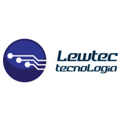
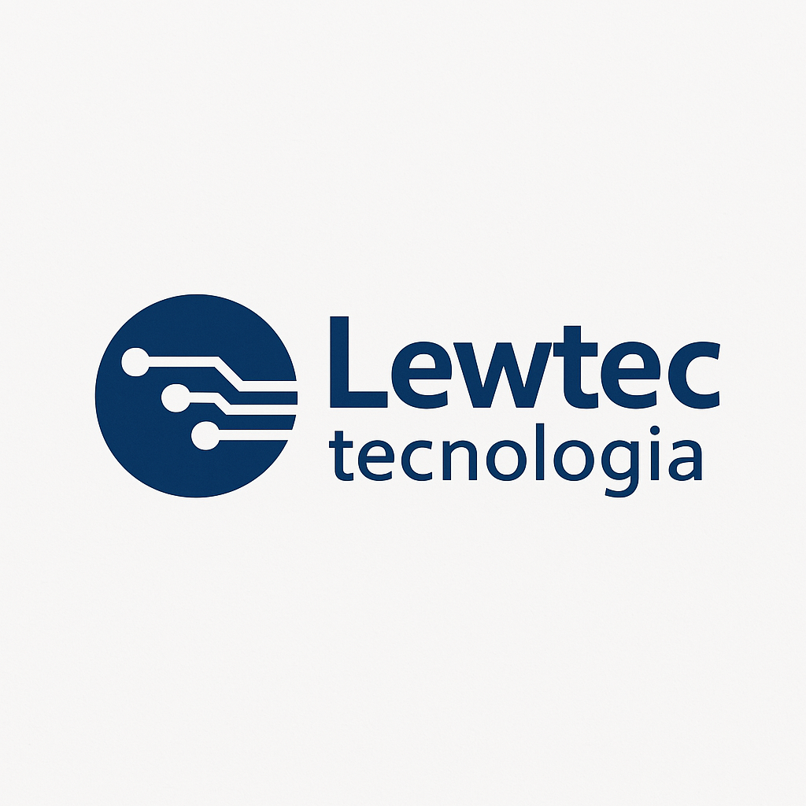
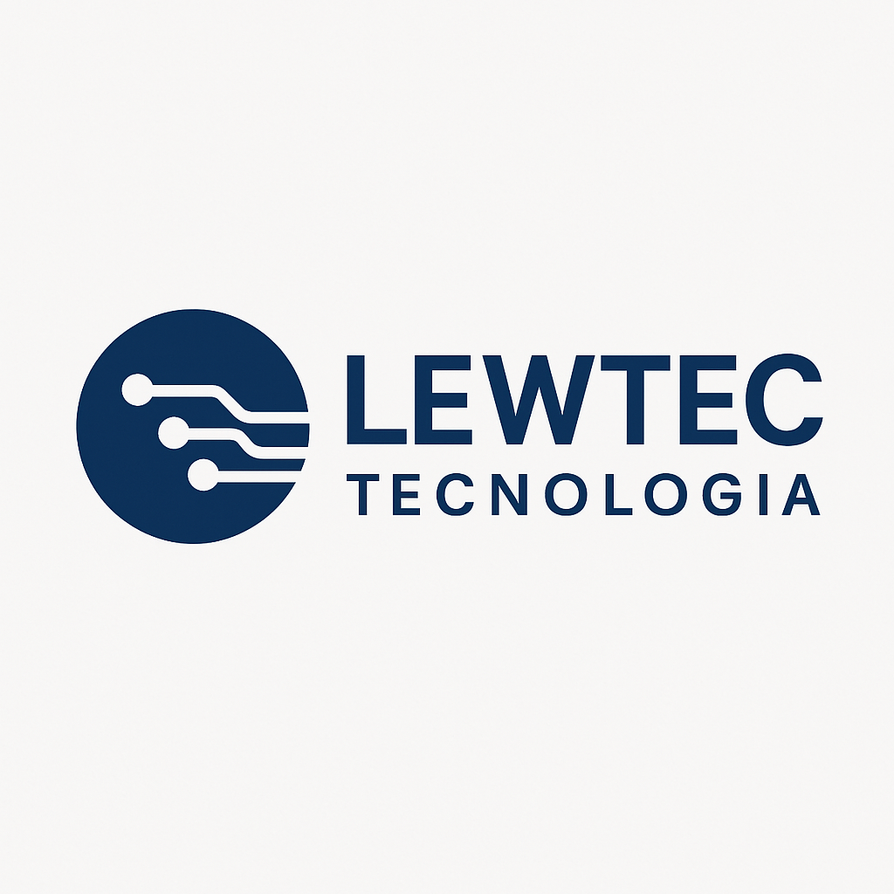
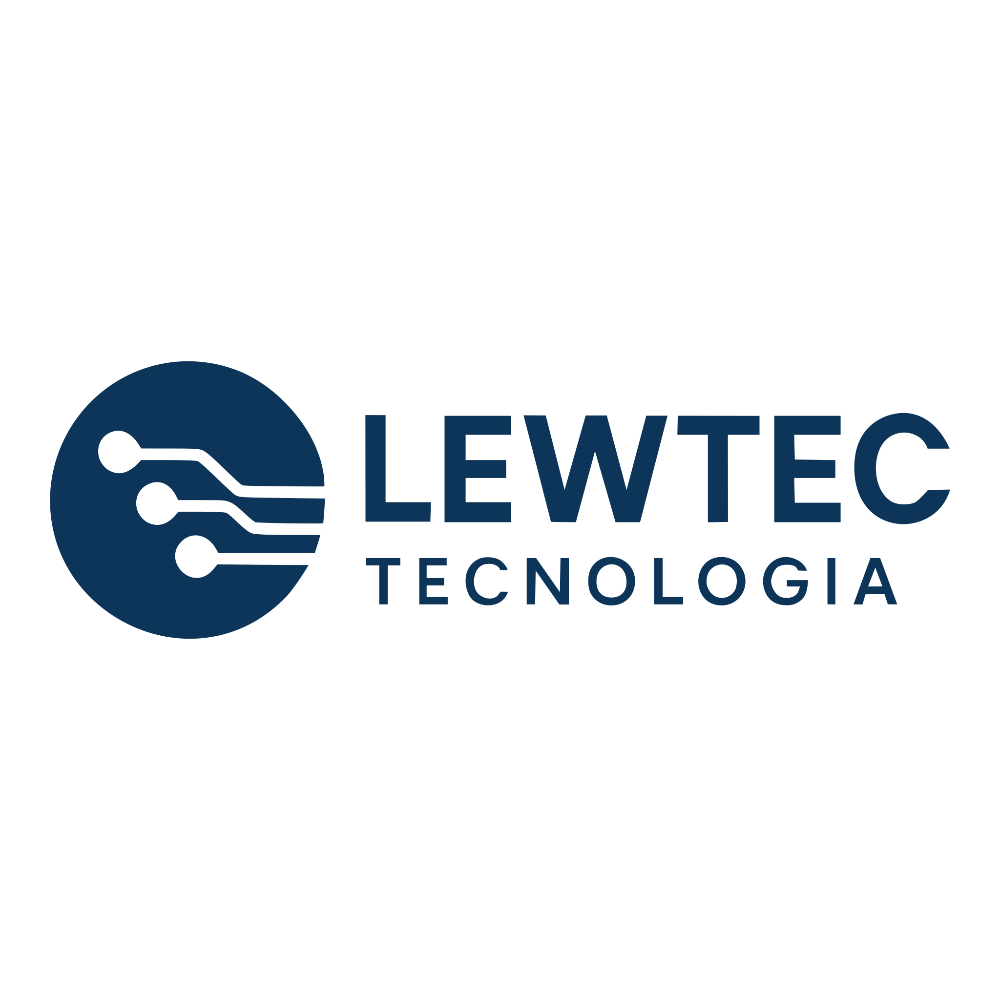

---

date: 2025-04-10T00:00:00
title: Como a IA me ajudou a fazer uma logo
summary: O processo que eu segui para fazer uma logo que ficasse do meu agrado
---

O jogo agora tá mudando. Eu oficialmente sou empresário, e já tendo que revisitar
a época jurássica pré naomeperturbe.com.br onde tem empresa pentelha me enchendo
os pacová.

O nome da empresa é LEWTec, eu queria algo simples, que se lê do mesmo jeito que
fala e se fala do mesmo jeito que lê, que não seja algo muito nada a ver, que não
tenha muita mensagem subliminar e nem seja muito gracinha. Lucão Tecnologia e Lucão
Enterprise foram opções descartadas por causa disso.

Todo esse processo começou por causa de um trabalho que não deu certo, mas foi a
fagulha para começar um novo arco na minha vida profissional. Apesar daquele fracasso
eu quis deixar a PJ e seus CNAEs o mais flexível possível para que eu possa trabalhar
com desenvolvimento, abrir um SaaS, fazer freela e outras coisas. Eu ainda não posso
vender produto diretamente mas posso vender serviço.

Todo o processo levou coisa de 1 mês até sair o CNPJ e deu pra saber precisamente quando
saiu porque os spammers não brincam em serviço.

Uma das coisas que é feita quando se abre uma empresa é uma logo. Um site legal para
buscar inspiração é o logomaker.com. Eu não tenho experiência com essas coisas então
superar a sindrome da folha branca foi um pouco mais difícil que o normal. Acabou que
das apresentadas eu gostei mais dessa. Temos uma v1!

Apesar de ter um MVP que já daria para usar, eu queria algo minimalista que fosse facilmente
vetorizável, e é ai que entra IA. Pedi para o ChatGPT dar pitaco na logo.

> 👨 O que você pode dizer sobre essa logo?

> 🤖 A logo pode dizer muito sobre a identidade visual e a proposta de uma empresa. Aqui está uma análise da logo que você compartilhou:
> 1. Elementos Visuais:
> 
>     Círculo Azul com Linhas e Pontos:
>     Representa claramente circuitos eletrônicos, o que remete a tecnologia, inovação e eletrônica. As linhas conectadas a pontos simulam trilhas de uma placa de circuito impresso (PCB), um símbolo comum em empresas de tecnologia.
> 
> 2. Cores:
> 
>     Azul Escuro:
>     Cor frequentemente associada a confiança, segurança e profissionalismo, especialmente em tecnologia e engenharia.
> 
>     Branco:
>     Transmite limpeza, clareza e modernidade.
> 
> 3. Tipografia:
> 
>     A fonte usada é moderna e com um toque futurista, refletindo inovação. O nome está escrito como:
> 
>         "Lewtec" em negrito e maior destaque.
> 
>         "tecnologia" em uma linha separada, com uma tipografia semelhante mas mais leve, indicando o setor da empresa.
> 
> 4. Nome:
> 
>     Lewtec Tecnologia:
>     O nome sugere que a empresa está voltada para soluções tecnológicas. "Lewtec" pode ser uma marca ou acrônimo, enquanto "tecnologia" reforça o segmento de atuação.
> 
> Impressão Geral:
> 
> Profissional, moderna e adequada para uma empresa da área de tecnologia, automação, eletrônica ou desenvolvimento de sistemas. A logo comunica bem sua área de atuação de forma clara e visualmente atraente.
> 
> Se quiser, posso ajudar a criar variações, aplicar essa logo em materiais (como cartões ou sites), ou mesmo preparar uma apresentação institucional com base nela. O que você tem em mente?

La garantia soy yo. Não sou o cara das referências de logo mas eu até que gostei da resposta.

> 👨 O que poderia ser melhorado?

> 🤖 Boa pergunta! A logo da Lewtec Tecnologia já tem uma base sólida e comunica bem o segmento da empresa, mas sempre dá pra fazer pequenos ajustes para torná-la ainda mais impactante. Aqui vão algumas sugestões de melhoria:
> 🔧 1. Legibilidade e Tipografia
> 
>     Problema: A palavra "tecnologia" está escrita em uma fonte mais fina e com uma forma um pouco futurista que pode comprometer a leitura rápida, especialmente em tamanhos menores.
> 
>     Sugestão: Usar uma fonte um pouco mais limpa ou com mais espaçamento pode melhorar a legibilidade sem perder a identidade.
> 
> 🎨 2. Contraste e Cores
> 
>     Problema: A cor azul escura no fundo com linhas brancas funciona bem, mas pode perder impacto visual em alguns fundos ou aplicações (por exemplo, materiais impressos ou telas escuras).
> 
>     Sugestão: Criar variações da logo com fundos claros e escuros. Talvez adicionar um leve degradê ou um efeito 3D sutil nas linhas do circuito pode dar mais profundidade.
> 
> 💡 3. Ícone x Tipografia
> 
>     Problema: O ícone (círculo com o circuito) está bem construído, mas parece um pouco genérico – muitas empresas de tecnologia usam algo semelhante.
> 
>     Sugestão: Customizar um pouco mais o símbolo para incluir algo mais único da marca, como uma letra estilizada, ou um toque visual que remeta ao nome "Lewtec".
> 
> 🧩 4. Alinhamento e Espaçamento
> 
>     Problema: A composição entre o ícone e o texto pode parecer um pouco solta ou desequilibrada em certos contextos.
> 
>     Sugestão: Testar versões com:
> 
>         O ícone centralizado acima do texto (para redes sociais).
> 
>         Texto alinhado verticalmente com o ícone (para materiais impressos ou websites).
> 
>         Um espaçamento mais coeso entre os elementos.
> 
> 🏷️ 5. Identidade de Marca Completa
> 
>     Sugestão adicional: Criar uma versão reduzida da logo (apenas o ícone, por exemplo) para uso em favicons, apps ou redes sociais. Além disso, definir um manual de identidade visual com paleta de cores, fontes e aplicações pode padronizar tudo e fortalecer a marca.
> 
> Se quiser, posso te mostrar exemplos visuais com essas sugestões aplicadas. Quer que eu faça um mockup com algumas dessas ideias?

> 👨 pode ser

Ai ele fez algumas perguntas sobre o que eu queria na logo.

> 🤖 Perfeito! Antes de gerar os mockups, só preciso confirmar alguns pontos com você:
> 
>     Você quer manter as cores azul e branco?
>     Ou gostaria de experimentar variações de cor (por exemplo: tons metálicos, azul claro, ciano, etc.)?
> 
>     Quer manter o estilo da tipografia atual, ou prefere ver opções com:
> 
>         Fontes mais modernas?
> 
>         Fontes mais legíveis?
> 
>         Fontes mais “tech” ou minimalistas?
> 
>     Tem algum slogan ou texto adicional que você gostaria de incluir em alguma versão da logo?
> 
>     Quais usos você imagina para a logo?
>     (ex: site, cartão de visita, uniforme, redes sociais, app, etc.)
> 
> Assim consigo montar variações mais alinhadas com o que você precisa.

> 👨 azul e branco de preferência, quero algo que tenha uma forma mais simplificada e minimalista então metálicos e degradês não são muito interessantes para mim, a tipografia eu quero que você me impressione porque eu não manjo, slogan não pensei em nenhum mas estou aberto a sugestões, usos eu imagino usar mais em site, invoice e fotos de perfil em redes sociais

E ele me gerou a seguinte imagem, só que não tava carregando por algum motivo na hora.

Ai eu pedi para ele refazer porque não tava carregando e essa foi a v2 oficial:

A logo ficou legal, na minha opinião, e poderia ser facilmente adaptada para funcionar em fundo preto, o que é uma coisa que
eu considero importante. A logo tem que ser generalizável, ser mais uma questão de forma do que de cor.

Agora é vetorizar isso ai.

Tentei pedir pro ChatGPT gerar um SVG da imagem e ele groselhou legal.

Tentei uma penca de site malaco, nenhum me gerava um resultado que me deixava contente.

Tentei replicar no Inkscape e tomei capote.

Ai descobri uma extensão para o Figma: Image Tracer. Importei a imagem no Figma, rodei a extensão e exportei em SVG.

A extensão já gera um SVG satisfatório, era só dar uns ajustes no Inkscape para "simplificar a malha" e separar os objetos.

Feito isso a logo ficou o seguinte:

Agora é só eu fazer um CSS bolado pra aplicar as cores certo, gerar as variações e começar a usar.

Talvez a logo ainda precise de uns ajustes, talvez eu ainda tenha uma ideia melhor, mas o fluxo para deixar pronto para
usar tá definido. Gostei do resultado!

Falando em logo, o projeto AGENA está precisando de uma logo, só que de preferência algo relacionado ao contexto do nome.
AGENA, ou ATV foi uma nave não tripulada usada em testes de acoplamento e rendezvous no programa Gemini, e também é o nome
de um navegador open-source que eu fiz para o protocolo Gemini. Mais informações em: https://github.com/lucasew/agena/issues/1.
Assim que essa logo sair, eu faço a integração e mando o aplicativo para o F-Droid.
