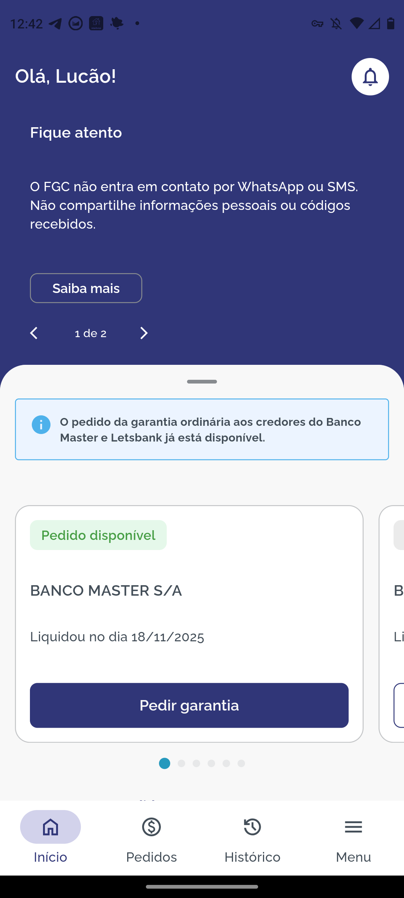
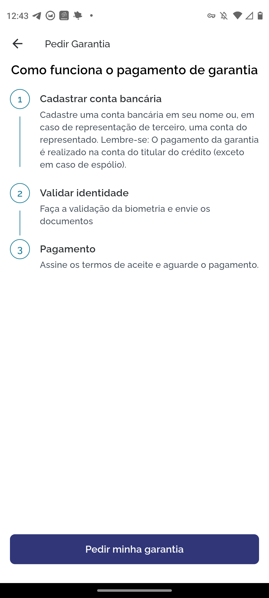
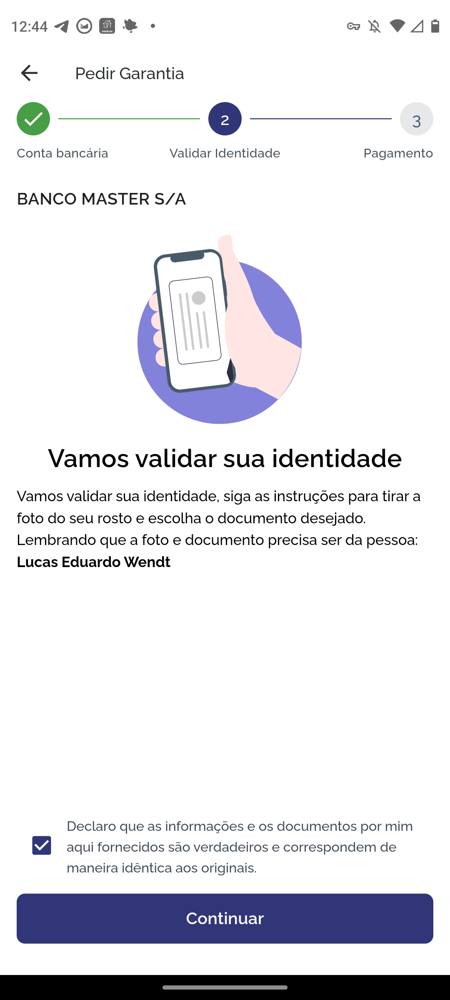

---

date: 2025-11-18T00:00:00
title: Acionando FGC
summary: O processo de acionar o FGC na prática
---

Rapaiz, eu sabia que esse dia eventualmente iria chegar mas não esperava que
fosse tão logo.

Basicamente eu investi no CDB do Banco Master ciente do FGC, dos riscos e acho
que foi uma boa decisão.

Não foi uma quantia muito exorbitante mas foi tudo naquela onda de títulos de
segunda mão com marcação a mercado favorável. Provavelmente um pessoal estava
acima da cota do FGC e estava se preparando para a quebra do banco, o que não
era muito uma questão de se mas sim uma questão de quando. Eu aproveitei os
títulos muito marcados pra baixo e consegui esses e mais dois de curto prazo que
já venceram.

    

      

      

        

      

    

Como dá pra ver pelo aplicativo, eu não tenho conta no Banco Master e comprei os
CDBs por corretora, no caso o BTG/AUVP Capital.

# Como eu fiquei sabendo

Fiquei sabendo scrollando o X, basicamente a [Lys](https://x.com/tech_lys) (não
sei o nome inteiro dela)
[perguntou como recupera dinheiro do FGC](https://x.com/tech_lys/status/1990788596492873963).
Saquei na hora, só pode ser o Master, até onde eu sei nenhum outro banco estava
na situação do Master de ficar perto de quebrar. De repente o negócio de
investir pesado em precatório e captação a juro bem acima do mercado não seja
bem a forma mais segura de um banco operar.

O peladobanco dela avisou da quebra. Provavelmente o BTG não me avisou ainda
porque o FGC ainda estava ingerindo a base.

Fui conferir no Google mesmo e tiro e queda, Banco Master oficialmente quebrou.
Mas eu to tranquilo porque eu to MUITO abaixo da cota do FGC e já aprendi como
essa parte do jogo funciona. Tinha feito perguntas sobre esse processo de
acionar o FGC na comunidade da AUVP e tinha o pessoal que contou a experiência
do BRK.

Primeira coisa que eu fiz foi ver como que loga e consulta. Baixei o app, criei
minha conta e presenciei a seguinte página lá dentro:

    

      

      

        

      

    

Basicamente procedimento padrão de criar conta, CPF, senha, email, pipipipopopo.

E tem um detalhe que precisa ser configurado também: pra onde que vão mandar o
dinheiro recuperado. Cadastrei a conta do Banco do Brasil mesmo e é isso ai. Vão
mandar por transferência bancária então eu não to esperando que vai vir um Pix
do nada como é com a restituição do IR.

# Pedindo o resgate

Ontem (17/01) enfim começaram a liberar os pedidos de pagamento do FGC. Um
processo que, eu pessoalmente, achei tranquilo e nada fora do esperado.

No dia 17 o app até abria mas começou a dar uns capotes e eu cheguei a tentar
alguams vezes mas sem sucesso ai eu só deixei quieto e voltei a mexer hoje (18).

O processo é bem tranquilo, você cadastra tua conta bancária, pode cadastrar
mais de uma contanto que ela esteja no teu CPF. Isso já dava pra cadastrar antes
de liberarem o pedido de garantia do Master.

No processo de pedido da garantia o app aparece assim:

    

      

      

        

      

    

Quando clica pra pedir aparece assim:

    

      

      

        

      

    

E ali começa o assistentezinho:

    

      

      

        

      

    

Na parte de validar documento é basicamente um botão pra enviar o documento e um
pra mandar a foto da cara. E eles aceitam mandar o PDF da carteira digital de
trânsito, o que já bota um app de contingência na frente do KYC de muito banco
já.

A parte de validação de cara pareceu custom, eu basicamente encaixei minha cara
no desenho, ele detectou, pediu pra segurar parado e foi de primeira (????).

Eu acho que foi assim de boa porque o objetivo do app é transferir para uma
conta do mesmo CPF, o desafio de implementar KYC é mais simples.

E como último passo tem o valor que eles vão pagar, onde eles vão pagar e um
termo para aceitar.

    

      

      

        

      

    

No fim das contas mostra que eles estão processando o pagamento, ai é só
esperar:

    

      

      

        

      

    

# O pagamento

Do nada chegou uma notificação de uma transferência recebida, e esse foi o fim
da saga.

    

      

      

        

      

    

# Impressões até o momento

- Para um app criado para uma situação específica, tá muito bom, muito liso,
  muito bem feito. É impressionante. Eu esperava um processo mais burocrático.
- Se fosse para sugerir um detalhe, seria a possibilidade de receber o valor
  pago no Pix com chave CPF, como já existe a opção para restituição de imposto
  de renda. Poderia ser mais dinâmico. A validação do CPF já foi feita pelo
  banco, teoricamente não teria onde dar problema.

# Situações que eu presenciei por aí

- Fiquei sabendo de pessoas que tiveram problemas na fase de validação de
  documentos se não usassem a CNH digital. CNH digital é tiro dado bugiu deitado
  basicamente.
- Will Bank entrou na ceifa e também vai ser coberto pelo FGC, e provavelmente
  vai entrar na mesma cota do Banco Master. Pra ser sincero não sei como esse
  detalhe vai funcionar. O Master tinha alguma relação com o Will.

# Timeline

<ul class="timeline timeline-vertical timeline-snap-icon">
  <li>
    
18/11/2025

    

    
Início do trâmite

    

  </li>
  <li>
    
17/01/2026

    

    
Liberação dos pedidos

    

  </li>
  <li>
    
18/01/2026 8h

    

    
Quando eu pedi

    

  </li>
  <li>
    
21/01/2026 14h

    

    
Recebimento do dinheiro

    

  </li>
</ul>
